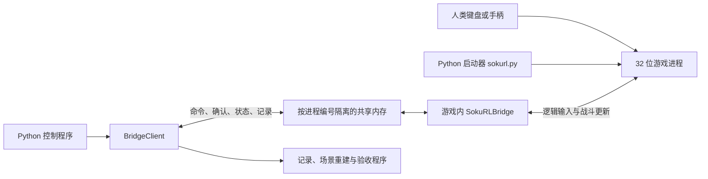

# SokuRL 架构与能力边界

本文依据仓库源码编写。README 中的历史实验数字不代表本机验收结果。

## 系统解决什么问题

SokuRL 让外部 Python 程序控制《东方非想天则》1.10a 的对战输入，并读取每个模拟帧的状态。模拟帧指游戏完成一次战斗更新；窗口刷新和 Python 查询不计为模拟帧。

游戏仍负责角色动作、碰撞、弹幕、伤害、随机数和资源加载。SokuRL 不包含游戏本体，也没有独立实现战斗模拟器。

## 进程与数据流

Python 使用 64 位解释器，游戏和加载到游戏中的 DLL 使用 32 位。双方通过共享内存通信，不能把 Python 进程的指针宽度当作游戏指针宽度。

共享内存名称为 `Local\SokuRLBridge_<pid>`，其中 `pid` 是游戏进程编号。每个游戏实例有独立的命令、状态、帧记录和检查点。

## 已实现的模块

| 模块 | 责任 | 当前边界 |
| --- | --- | --- |
| `tools/sokurl.py` | 校验游戏、启动 Practice/VS/回放、查询和关闭指定进程 | 游戏目录写在模块常量中，未读取 `config/game.yaml` |
| `native/SokuRLBridge/SokuRLBridge.cpp` | 在游戏输入和战斗更新函数处接入控制，发布状态，暂停和步进 | 游戏版本和内存地址固定；需要 SokuLib |
| `native/SokuRLBridge/ControlBlock.hpp` | 定义 C++ 共享内存结构与命令编号 | 与 Python 结构必须逐字节一致 |
| `native/RuntimeModules/CMakeLists.txt` | 构建运行所需的加载器和四个社区模块 | 使用安装文档中固定版本的第三方源码 |
| `tools/bridge_shared.py` | Python 共享内存结构、命令发送、状态快照和帧读取 | 调用方负责等待确认并检查结果 |
| `tools/frame_runtime.py` | 帧导航计划、检查点标识和记录计数 | 不直接运行游戏 |
| `tools/frame_validation.py` | 启动检查点、重放输入、比较状态与实例隔离 | 同时被场景运行代码当作运行库使用 |
| `tools/scenario_runner.py` | 保存和加载场景锚点、解析输入脚本、执行动作 | 文件格式是受限的 YAML 风格语法；不是完整 YAML 解析器 |
| `tools/raw_recorder.py` | 把状态和输入写入 CSV、JSON 文件 | 需要调用方持续读取帧缓冲区 |
| `tools/control_panel.py`、`tools/debug_panel.py` | 人工调试控制、帧导航和记录界面 | 不是面向玩家的完整启动界面 |
| `tools/*validation.py` | 验证对战、回放、场景重建和加速一致性 | 需要真实游戏和已安装模块 |
| `tests/test_bridge_protocol.py` | 检查结构尺寸、协议编号、帧规则、脚本与记录 | 不证明 DLL 能加载或游戏能对战 |

`src/soku_rl` 尚未接入上述运行链路。它包含少量状态类型和动作枚举；环境、奖励、重置、观测转换、键盘控制等文件仍是占位文件。安装包成功不等于存在可调用的强化学习环境。

## 原生依赖

SWRSToys 通过 `d3d9.dll` 加载模块。当前启动路径依赖以下组件：

| 组件 | 用途 |
| --- | --- |
| SokuLib | 编译桥接模块时使用的游戏结构和函数定义 |
| SokuRLBridge | 命令处理、输入控制与状态采集 |
| SkipIntro | 提供 Practice 预设以及 VS 启动所需角色、配色和卡组配置 |
| WindowResizer | 窗口设置 |
| MemoryPatch | 提供 `AllowMultiInstance` 多实例补丁 |
| ReplayDnD | 从命令行加载回放 |

源码中的 CMake 要求 `third_party/SokuMods/SokuLib`。初始检出只有 `third_party/SokuLib` 等占位目录，没有对应源码或子模块锁定信息。不能仅凭执行 `pip install -e .` 完成整个运行环境安装。

## 一次程序控制的时序

1. 启动器校验 `th123.exe` 的 MD5 为 `DF35D1FBC7B583317ADABE8CD9F53B2E`。
2. 游戏加载 SWRSToys 与桥接 DLL，创建共享内存。
3. Python 按进程编号连接，验证 ABI。ABI 是双方约定的数据结构、尺寸和字段布局；当前版本为 6。
4. 控制程序发送暂停命令，等待确认，读取基准帧。
5. `step_with_inputs(p1, p2)` 同时设置双方输入，并请求执行一个模拟帧。
6. 桥接模块在 `KeymapManager::SetInputs` 处应用输入，在原始 `BattleManager::onProcess` 完成后增加帧号、计算状态哈希并发布状态。
7. 调用方检查命令确认、结果码、帧号增加一和再次暂停，然后决定下一次输入。

命令确认表示命令已被处理，不单独证明动作已完成。`wait_for_ack()` 超时后会返回最后一次快照，不抛出超时异常；调用方必须检查返回的 `ack_seq`，还要检查帧号和命令结果。

## 人类游玩与程序控制

桥接函数先调用原始输入处理，再根据控制命令覆盖输入。无程序控制时，原始键盘或手柄输入路径仍存在；这属于源码结论，必须通过真实设备操作验收。

`send_action()` 控制 P1，适合连续运行中的有限帧动作。`step_with_inputs()` 同时控制 P1 和 P2，并在一个模拟帧后暂停，适合自动对战验收。后者不能直接作为实时人机对战的输入方案，因为它会覆盖双方输入并暂停游戏。

从自动控制切回人类操作需要释放受控输入并恢复运行。人类与程序各控制一方的实时模式，还需要明确玩家归属、断开连接后的输入释放和暂停恢复行为。

## 状态记录与重建

每帧含双方角色状态、最多各 64 个对象以及状态哈希。ABI v6 的 `RawFrameState` 为 10,596 字节，`ControlBlock` 为 10,884 字节。对象超限必须检查相应溢出标记。

512 帧环形缓冲区用于传输记录；它只有一个生产者和一个消费者。两个读取程序不能同时消费同一实例的记录。`dropped_frames` 不为零时，不能宣称记录完整。

检查点通过固定初始状态并重放双方输入恢复目标帧。动作、动画、弹幕与对象必须由游戏重新模拟；只允许直接恢复已列明的简单数值字段。原生重建历史容量为 4,096 帧。它不是可以任意保存和恢复整个进程内存的存档。

## 加速边界

`--headless` 跳过已定位的战斗渲染区间，仍然创建窗口并初始化 Direct3D、资源和音频。`--unlimited` 还取消本地 VS 战斗中的计时等待，且要求同时开启 `--headless`。

速度与稳定并发数必须在目标机器重新测量。README 中的 8 实例和每秒模拟帧数来自其他运行记录，不能作为本机配置依据。

## 当前架构问题

1. 生产路径集中在 `tools`，可安装的 `src/soku_rl` 尚未提供运行接口，调用方依赖脚本目录导入。
2. 场景执行依赖 `frame_validation.py`，运行逻辑和验收逻辑相互耦合。
3. 原生桥接文件同时承担启动、输入、状态采集、同步和重建，修改影响难以局部判断。
4. Python 与 C++ 手写两份协议定义，需要持续验证布局和版本一致性。
5. 启动失败路径和确认超时行为尚未统一；新接口应保证明确失败和只清理自己启动的进程。
6. 配置文件与实际启动常量并存。安装文档已记录第三方版本和部署清单；依赖获取、配置生成与部署仍需整理为统一安装入口。

后续顺序和验收条件见 [开发计划](development-plan.md)。
