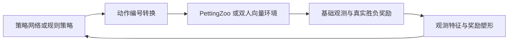

# 帮助策略学习的环境包装层

## 目标与位置

基础环境负责真实游戏规则、信息可见性、输入延迟、逐帧推进和重置。包装层负责让学习算法更容易使用这些输入。它不能读取新的内存字段，不能缩短延迟，也不能替策略执行额外游戏帧。



`learning_wrappers.py` 的 `LearningEpisode` 保存每局历史和奖励势函数。`LearningParallelEnv` 与 `LearningVectorEnv` 复用它。`learning_features.py` 只从公开观测计算数值特征；它没有进程句柄或内存读取接口。

配置统一位于 `config/wrappers/`。运行记录保存解析后的配置。加载模型时同时检查基础环境和包装层配置；维度碰巧相同不代表模型可以混用。

## 观测

拟人学习配置保留原来的 1600 维状态历史，追加 37 维派生特征和 64 维己方按键历史，共 **1701 维**。

| 追加内容 | 维数 | 信息来源 |
| --- | ---: | --- |
| 双方共同可见标记、相对位置及距离 | 4 | 当前过滤后的角色位置 |
| 双方可见标记和位置变化 | 6 | 最近状态历史中的首尾位置 |
| 离己方最近的己方与敌方物体，各 4 个 | 24 | 可见物体位置；每个含标记和两个相对坐标 |
| 血量差、灵力差、已用帧数占比 | 3 | 可见界面数值和己方时钟 |
| 己方最近 8 次提交的按键 | 64 | 策略自己提交的 8 个逻辑输入值 |

角色不可见时，相对位置及移动特征填零，并提供无效标记。物体槽不包含被过滤掉的物体。位置变化是屏幕上两次采样之差，仍含相机移动和量化误差，不是引擎中的精确速度。

己方按键历史不包含对手输入。默认每 3 帧决策，8 次按键记录覆盖 24 个模拟帧，包含默认 12 帧输入延迟内的待执行动作。重置清空它，并填入无按键状态。

超人学习配置保留 1356 维诊断观测，追加 64 维己方按键历史，共 **1420 维**。它不使用屏幕相对特征。图像环境仍可使用 `wrappers=raw`；尚未实现从像素提取血量或把图像与按键历史组合成字典观测，遇到不支持的组合会报错。

## 动作

| 配置 | 动作数 | 定义 |
| --- | ---: | --- |
| `full` | 576 | 9 种方向组合乘以 64 种按钮组合 |
| `combat` | 90 | 9 种方向组合乘以下列 10 种按钮组合 |

10 种按钮组合为：无按钮、A、B、C、D、换卡、符卡、A+D、B+D、C+D。A/B/C 为攻击键，D 为冲刺键。精简配置删除了其余同时按键组合，因此不能声称与完整动作空间等价；它是减少探索负担的实验配置。完整空间一直可选。

包装层只转换当前提交的按键编号，不执行自动连招。一次选择仍保持到下一次决策，仍经过基础环境的延迟队列。规则策略也经过同一个映射；规则请求了未提供的组合时直接报错。

## 奖励

基础奖励保持为胜利 1、失败 -1、同时击倒和超时 0。超时仍由 `truncated=True` 和 `outcome=time_limit` 区分，不按剩余血量判胜。

学习配置采用势函数奖励塑形。设公开观测中双方归一化血量为 \(h_i\) 与 \(h_j\)，系数为 \(\alpha\)：

\[
\Phi_i(o_t)=\alpha(h_i(o_t)-h_j(o_t)),\qquad
r'_{i,t}=r_{i,t}+\Phi_i(o_{t+1})-\Phi_i(o_t).
\]

击倒和超时都将终局势函数设为零。当前算法配置的折扣为 \(\gamma=1\)，因此：

\[
\sum_{t=0}^{T-1}r'_{i,t}
=\sum_{t=0}^{T-1}r_{i,t}-\Phi_i(o_0).
\]

双方从满血开始时，初始势函数为零，整局累计奖励与原来的胜负奖励完全一致。造成伤害可以提前产生正反馈，但局末必须结清；只在超时时保留血量优势不能获得额外总收益。训练入口拒绝将该包装层与非 1 的折扣组合。

双方的血量势函数互为相反数，奖励仍为零和。`info` 同时记录 `base_reward` 与 `shaping_reward`。评估只看真实胜负、超时和交换座位后的统计，不用中途塑形奖励判定谁更强。

方法依据：[Ng、Harada、Russell 的奖励塑形论文](https://ai.stanford.edu/~ang/papers/shaping-icml99.pdf)。上面的整局求和关系也直接给出了本项目有限时长设定下的约束。

## 记忆和训练

短历史不能覆盖长时间遮挡，因此增加公开的 [SB3 RecurrentPPO](https://sb3-contrib.readthedocs.io/en/master/modules/ppo_recurrent.html) 路径。它用 LSTM 保存历史信息；每个对局、每个座位各自拥有记忆，重置时清空。推理时也采用这个规则。

```text
python tools/train.py --config-dir config/local +machine=gpu41 algorithm=ppo wrappers=learning
python tools/train.py --config-dir config/local +machine=gpu41 algorithm=recurrent_ppo wrappers=learning
python tools/train.py --config-dir config/local +machine=gpu41 algorithm=nfsp wrappers=learning
python tools/train.py --config-dir config/local +machine=gpu41 algorithm=ippo wrappers=learning
python tools/train.py --config-dir config/local +machine=gpu41 algorithm=psro wrappers=learning
python tools/train.py --config-dir config/local +machine=gpu41 algorithm=recurrent_ppo track=superhuman wrappers=superhuman_learning
```

PPO 从每局固定的规则对手分布中抽样，分别训练两个座位。IPPO、NFSP 和 PSRO 仍使用双人学习接口。算法的动作维度从包装后环境读取，不再写死为 576。

## 验收与后续实验

现有检查覆盖：两种环境接口使用相同转换；动作映射可逆；输入延迟不变；部分重置不影响其他实例；击倒和超时的整局奖励结算；TorchRL 张量空间；NFSP 的 90 动作更新；模型加载输出一致性；循环策略的跨局记忆隔离。

这些检查不证明包装层提高胜率。训练需保留原始配置对照，并在同一规则对手列表和交换座位的完整比赛中评估。模型选择使用验证种子；最终验收需在模型固定后使用另一组未参与选择的种子。当前[规则策略池](rule-policy-pool.md)包含 15 个非空闲对手，按现有的“至少击败一半对手”规则，每条赛道需击败至少 8 个。击败某个对手指真实胜局比例超过一半，超时不计胜。旧的五对手结果不能直接与扩充后的结果比较。

仍需补齐：结构化观测中的可见动作姿态和卡牌界面信息；图像与己方按键历史的组合；更长训练下的强度比较。当前位置与血量特征不足以表达画面里全部可见的战斗信息，不能据此宣称已经得到最强策略。
