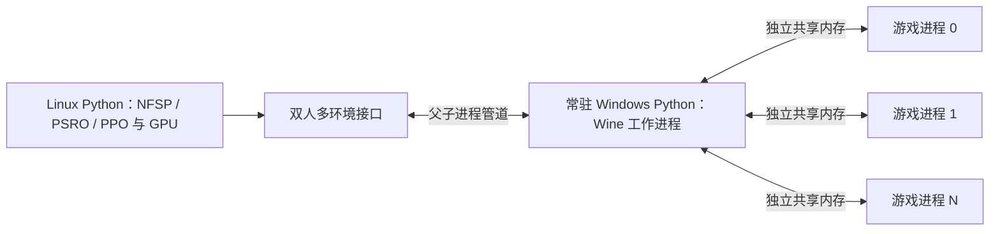

# 双人环境、多环境采样与公开算法

## 交付范围

环境实现 [PettingZoo Parallel API](https://pettingzoo.farama.org/api/parallel/)，观测和动作空间使用 Gymnasium。
一局有 `player_0`、`player_1` 两个玩家。环境不内置对手，不共享双方策略，也不把两人合成一个学习器。

已实现以下代码接入：

- RLCard 1.2.0 的 [NFSPAgent](https://github.com/datamllab/rlcard/blob/master/rlcard/agents/nfsp_agent.py)：采样器提交双方各自的完整转移，学习、经验回放和平均策略训练由上游实现负责。
- OpenSpiel 2.0.2 的 [PSROSolver](https://github.com/google-deepmind/open_spiel/blob/v2.0.2/open_spiel/python/algorithms/psro_v2/psro_v2.py)：复用策略选择、收益矩阵更新和混合策略求解；将游戏树递归采样替换为真实游戏的批量采样。
- Stable-Baselines3 2.9.0 的 [PPO](https://stable-baselines3.readthedocs.io/en/master/modules/ppo.html)：作为 PSRO 的响应策略训练器。仅在训练某一方的响应策略时，提供一个内部管理对手的单智能体视图；底层仍是双人环境。

这次交付不包含新的对战性能数据或训练收敛结果。原有 90 局报告属于旧评估入口，不能作为新接口或新算法接入已经通过运行验收的证据。

## 进程结构



Windows Python 控制游戏，Linux Python 使用原生 PyTorch。模型和 CUDA 不需要装入 Wine。
工作进程的标准输出只传输结构化消息，诊断文字进入 `worker.log`。管道中的 Python 序列化格式仅用于自己启动的可信子进程，不提供网络监听接口。

**Python 环境对象和 Wine 工作进程常驻；每次重置仍重开被选中的游戏子进程。**
未实现游戏进程内部的完整快速重置，没有宣称消除了此前的启动开销。
重置请求是同步的：同一工作进程中的其余对局保留原状态，但调用方要等重置完成后才能继续提交该组动作。它不是异步完成、持续补充样本的采样器。

## 单个双人环境

```python
from soku_rl.env import EpisodeConfig, HisoutenParallelEnv
from soku_rl.worker_pipe import WorkerBackend

# command 是实际安装好的 Windows Python 命令，Linux 上可使用 Wine 包装脚本。
backend = WorkerBackend(
    command=["/absolute/path/run-python.sh", "tools/rollout_worker.py"],
    cwd="/absolute/path/SokuRL",
    log_path="logs/worker.log",
    timeout=300.0,
    launch_timeout=180.0,
)
env = HisoutenParallelEnv(backend, EpisodeConfig(max_frames=7200, history_frames=4))
try:
    observations, infos = env.reset(seed=123)
    while env.agents:
        actions = {agent: env.action_space(agent).sample() for agent in env.agents}
        observations, rewards, terminated, truncated, infos = env.step(actions)
finally:
    env.close()
```

这是双方同时行动的接口；不能只提交一方，也不能先推进一方再让另一方看结果选动作。
到达终局后，最后一步仍返回双方的终局观测，`env.agents` 变为空列表。开始下一局必须调用 `reset`。
关闭后的对象不能再次使用。

标准 `reset(seed=None, options=None)` 的两个默认参数遵循第三方接口约定。`seed=None` 表示从该环境的随机数发生器抽取下一局种子，不表示忽略无效输入。未实现的 `options` 会报错。
原生模块把 `0xFFFFFFFF` 用作未指定种子的标记，因此本接口接受从 0 至 4294967294 的整数种子。

## 多环境接口

`TwoPlayerVectorEnv` 在外层增加环境编号，内层仍保持双方玩家编号：

```python
from soku_rl.env import EpisodeConfig, TwoPlayerVectorEnv

env = TwoPlayerVectorEnv(backend, num_envs=16,
                       config=EpisodeConfig(max_frames=7200, history_frames=4))
observations, infos = env.reset({i: 1000 + i for i in range(16)})

actions = {
    i: {"player_0": policy_0[i].act(observations[i]["player_0"]),
        "player_1": policy_1[i].act(observations[i]["player_1"])}
    for i in observations
}
observations, rewards, terminated, truncated, infos = env.step(actions)

# 仅在需要开始新局的环境上调用；这里的 3 和 9 只是编号示例。
new_observations, new_infos = env.reset({3: 2003, 9: 2009})
```

最后一次重置仅替换 3、9 两个环境的游戏进程和观测历史。其他环境不重置。
`step` 也可以提交环境子集；没有提交动作的环境保持暂停。
各环境可以处于不同的帧号，分别等待自己的目标帧完成。
出现步进错误时，受影响的环境要求重新 `reset`，不会把半完成的数据继续交给学习器。

这不是 Gymnasium 的单智能体 `VectorEnv`。直接把环境维度和玩家维度展平会丢失双方联合推进、共同终止的约束，不能这样传入普通单智能体采样器。

## 空间、奖励与结束条件

| 项目 | 定义 |
| --- | --- |
| 玩家 | `player_0` 为 1P，`player_1` 为 2P |
| 动作 | 每方 `Discrete(576)`，完整表达水平轴、垂直轴及六个按钮 |
| 一步 | 双方动作共同推进一个模拟帧；不自动重复多帧 |
| 观测 | 每帧 339 个 float32；默认叠加最近四帧，形状为 `(1356,)` |
| 中间奖励 | 双方均为 0 |
| 击倒 | 胜方 1、负方 -1，双方 `terminated=True` |
| 同时击倒 | 双方 0，双方 `terminated=True` |
| 达到帧数上限 | 双方 `truncated=True`，保留 `outcome=time_limit` |

动作编码包含全部 576 种按键组合，不限制为手工宏动作。无按键动作编号是 **256**，不是 0。
所有组合都可提交；角色当前无法执行某个动作时，游戏可能忽略或缓存输入，这不等于接口动作非法。

每帧观测的顺序为：已用帧数除以上限；己方九个字段；对手九个字段；64 个对手弹幕槽。
九个角色字段是位置横纵坐标、血量、灵力比例、动作编号、腾空标志、命中停顿、角色编号、朝向。
弹幕槽包括有效标志、位置横纵坐标、速度横纵分量，未使用槽填零。数值缩放常量见 `encoding.py`。
重置时历史栈用本局初始观测填充，不携带上一局数据。

这仍是内部数值观测，不是完整引擎状态或完整历史信息。`state()` 明确报不支持，不伪造供集中式价值网络使用的完整状态。

## NFSP 的多环境接入

训练器只创建两个 `NFSPAgent`，每个玩家位置一个。每个学习器的网络、优化器、强化学习回放池和监督学习蓄水池在所有环境之间共用。
每个环境、每个玩家分别在 episode 开始时抽取一次“最佳响应 / 平均策略”模式，并保持到本局结束。
RLCard 将该模式存放在 `_mode`，适配器在调用对应玩家前恢复该局模式。这一接入按 RLCard **1.2.0** 的源码实现。
转移显式包含本环境的旧观测、动作、奖励、下一观测和结束标志，不把不同环境的相邻调用当作同一条轨迹。

## PSRO 的接入

1. 为 1P、2P 分别维护策略集合。角色随座位固定，不能声明这是对称博弈。
2. OpenSpiel 选择要训练的响应策略及对手混合分布。
3. PPO 在每局开始时从对手分布抽取一个策略，整局保持该策略及其独立随机数状态。
4. 新策略完成训练后保存模型；旧策略不会继续被优化。
5. 真实双人多环境采样估计新增收益矩阵项，由 OpenSpiel 更新混合策略。

当前使用 OpenSpiel 的投影复制动态方法（在概率分布约束下迭代更新各策略概率）求解元策略，不宣称得到了精确纳什均衡。
不提供任意状态克隆、完整游戏树或精确最佳响应，因此不支持直接调用依赖这些能力的 OpenSpiel 算法。

PSRO 的收益矩阵按**固定玩家位置**定义，不等于此前交换策略座位后得到的均衡比较矩阵。

## 超时的训练含义

环境始终保留终止和截断的区别。两个参考训练入口要求显式配置 `timeout_payoff: zero_at_horizon`：学习的是最多 7200 帧、到达上限后没有额外收益的博弈。

NFSP 对这种截断不再自举未来价值。PPO 视图也不设置 SB3 的 `TimeLimit.truncated=True`，防止 SB3 自动加入超时状态的价值估计；原始截断信息保留为 `source_truncated`。
这属于明确选择的训练目标，不是把自然比赛的超时判为平局。原来的胜率评估器仍报告超时次数和收益上下界。
默认奖励仅在终局出现；这些接口不构成策略已经学会有效对战的证据。

## 安装和配置

游戏工作进程继续使用已安装游戏与模块的 Windows Python。Linux 学习器使用另一个 Python 3.11 环境，在其中安装适配 GPU 驱动的 CUDA 版 PyTorch，再安装：

```bash
python -m pip install -e '.[rl,nfsp,psro]'
```

所有配置统一在 Hydra 的 `config/` 空间。`config/train.yaml` 组装环境、运行方式和算法，`config/algorithm/` 保存 NFSP、PSRO 参数。
`runtime.command` 必须给出命令参数列表。不要使用一段需要 shell 再解释的命令字符串。

把机器专用配置放在不提交到 Git 的 `config/local/machine/server.yaml`：

```yaml
# @package _global_
runtime:
  command: [/absolute/path/run-python.sh, tools/rollout_worker.py]
  cwd: /absolute/path/SokuRL
device: cuda:0
```

运行：

```bash
python tools/train.py --config-dir config/local +machine=server algorithm=nfsp
python tools/train.py --config-dir config/local +machine=server algorithm=psro
```

配置要求 CUDA 时，无法使用 CUDA 会直接报错，不自动退回 CPU。
输出目录包含配置、依赖版本、训练侧与工作进程侧的源码和游戏文件指纹、运行记录与模型检查点。
已有输出目录不会被覆盖。当前提供模型保存，没有实现完整采样器与全部在途 episode 的断点恢复。

## 后续验收

本次未新增或运行实现测试，也未启动正式训练。下一次运行验收应覆盖完整的多环境 episode、部分重置后未选中环境的轨迹保持、终止与截断的转移处理，以及公开算法的实际学习更新。
进程内快速重置仍是独立的原生工程任务，需要核对完整内部状态和跨 episode 隔离；没有用回血或接下一小局代替它。
